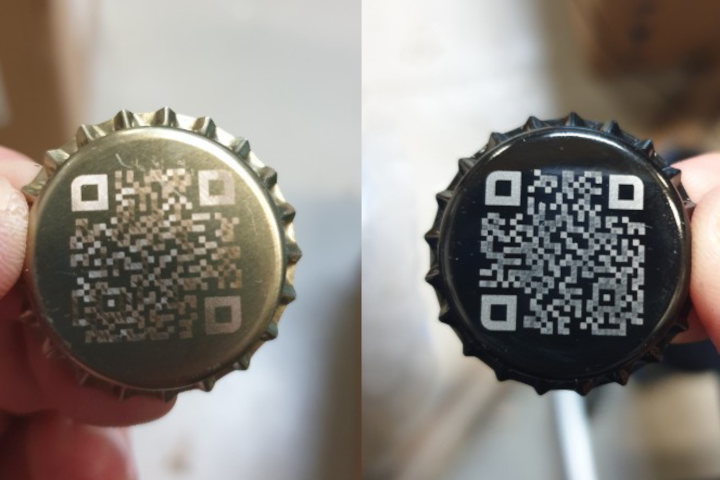
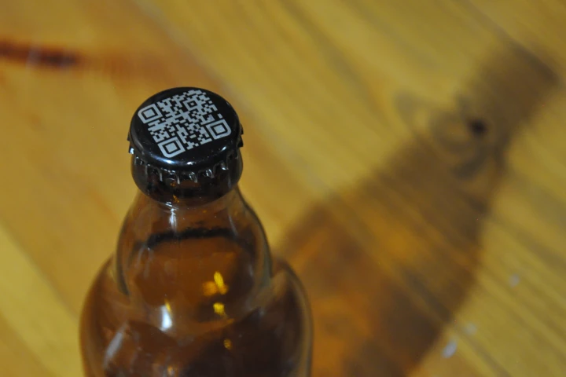

## About

Manually writing beer names and other details on every bottle didn't seem like a great idea.
I needed something better that wouldn't add even more time to the already long process.

Instead of creating custom stickers or labels and manually applying them by hand, I decided to print a QR code on a bottle cap.
Engraving logos on caps is pretty common, so ordering them in bulk wasn't hard.

## QR Engraving

Creating QR codes is easy, but it's important to keep the encoded linka as short as possible.
The first versions pointed directly to [jarzebowski.net/beer](/beer), but that resulted in very tiny squares that where hard to scan with a phone.

**Early failed versions**

Almost all QR code generator outputs cause issues when used directly in a laser path generator.
The SVG file needs to be manually edited - connecting every individual rectangle with its neighbors.

Golden-colored caps also caused scanning inaccuracy, so right now I'm using black-painted ones, which can chip away during capping.

**Final product**

## Unexpected result

When I enlarged the QR code to make it easier to scan, I lost the ability to link users directly to the beer archive page.
The final QR code now points to my website's landing page.

But maybe that turned out to be a good thing?
Now my beer caps double as very weird business cards.
