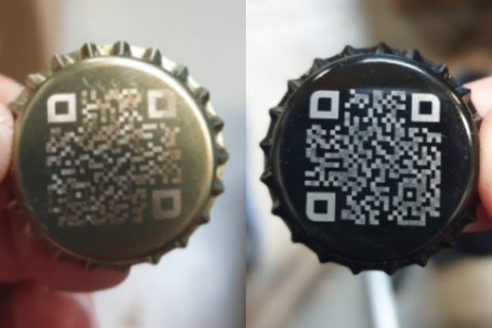
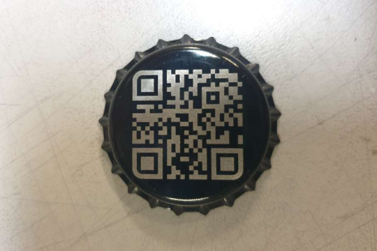

# About

Manually writing beer names and other details on every bottle didn't seem like a great idea.
I needed somethig better, that does not add to already long process.

Insterd of making stickers and manually applying them to every bottle, I decided printing QR code on a bottle cap.
Engraving logos on caps is pretty popular thing to do, so getting them in bulk wasn't hard.

# QR Engraving

Creating QR codes is pretty straightfoward, but we need to keep link length they encode to a minimum.
First versions pointed directry to [jarzebowski.net/beer](/beer), but this caused tiny squeres that are hard to scan with phones.

**Early failed versions**

There was a issue with laser path caused by almost all QR generators.
The SVG file needs to be manually edited - connecting every individual rectangle with its neighbours.

Golden caps also caused scanning inacuracy, so right now I'm stuck to black paint ones that can chip away when capping. 

**Final product**

# Unexpected result

When enlarging the QR code squeres to make it easier to scan, I lost ability to link users directly to the beer archive page.
Now, the code points us to my website landing page.

But maybe, that turned out to be a good thing?
Now my beer caps double as very werid business card.